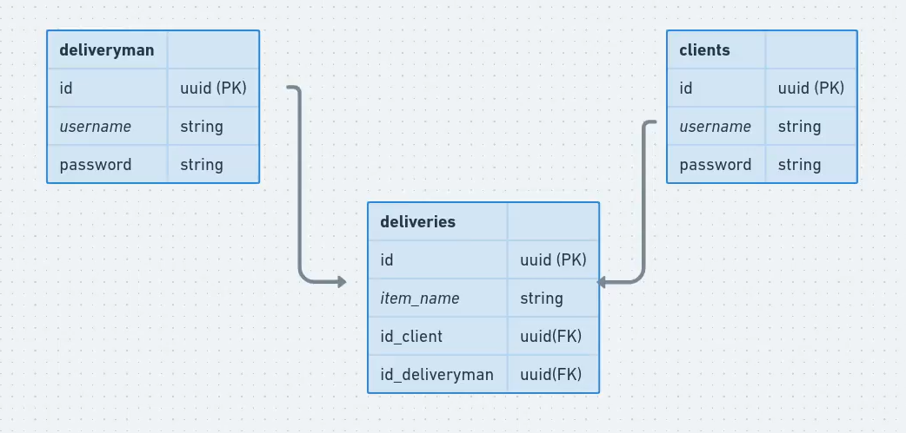

# Prisma Deliveries API

## Índice

<!--ts-->
   * [Índice](#índice)
   * [Sobre o projeto](#sobre-o-projeto)
   * [Modelo Entidade-Relacionamento](#modelo-entidade-relacionamento)
   * [Como rodar na sua máquina?](#como-rodar-na-sua-máquina)
   * [Explorando a API com Insomnia](#explorando-a-api-com-insomnia)
<!--te-->

## Sobre o projeto

Este projeto é uma API que gerencia um serviço de tele-entregas. O projeto foi ministrado pela professora Daniele Leão e o objetivo da realização dele foi o de praticar o ORM Prisma.

Dentre as ferramentas utilizadas, destacam-se:

- [Express](https://expressjs.com/)
- [Prisma](https://www.prisma.io/)
- [TypeScript](https://www.typescriptlang.org/)
- [JSON Web Token](https://jwt.io/)

Além disso, a fim de esclarecer a estrutura de pastas deste repositório, expresso que - dentro da estrutura de ensino do Ignite da Rocketseat - esse projeto é um módulo avulso à trilha Node.js 2021.

## Modelo Entidade-Relacionamento

<h1 align="center">
  
</h1>

## Como rodar na sua máquina?

> :warning: **Ferramentas Necessárias:** [Node.js](https://nodejs.org/en/) e [Git](https://git-scm.com) (ou [GitHub Desktop](https://desktop.github.com/)).

1. Clone este repositório. Pode ser através do seguinte comando:

```bash
git clone https://github.com/Marcel099/ignite-node
```

2. Entre, via CLI, na pasta `modules/backend-entregas` deste repositório.

```bash
cd modules/backend-entregas
```

3. Instale as dependências localmente:

```bash
# npm
npm install

# yarn
yarn
```

4. Criar um banco de dados [PostgresSQL](https://www.postgresql.org/). Isso pode ser feito através do [Docker](https://www.docker.com/) também e utilizar o arquivo `docker-compose.yml` do projeto como base.

5. Renomear o arquivo `.env.example` para `.env`.

6. Modificar a variável de ambiente `DATABASE_URL` no arquivo `.env.example` de acordo com as condições locais do seu banco de dados PostgresSQL. Isso é necessário para que o correto funcionamento do Prisma.

7. Preencher as variáveis de ambiente `JWT_CLIENT_SECRET_KEY` e `JWT_DELIVERYMAN_SECRET_KEY` com uma string. É necessário para a autenticação com JWT. Recomendo preenchê-las utilizando Hash MD5.

8. Rodar as migrações do Prisma para que o banco de dados PostgresSQL fique com a estrutura que a API necessita para funcionar:

```bash
# npm
npm prisma migrate dev

# yarn
yarn prisma migrate dev
```

9. Levantar a API através de:

```bash
# npm
npm run dev

# yarn
yarn dev
```

## Explorando a API com Insomnia

Se desejar explorar a API com o software Insomnia utilizando a coleção que criei durante o desenvolvimento desta API, você pode fazer isso ao importar os dados da minha coleção para criar uma no seu computador.

[](https://insomnia.rest/run/?label=Prisma%20Deliveries%20API&uri=https%3A%2F%2Fraw.githubusercontent.com%2Fmarcel099%2Fignite-node%2Fmain%2Fmodules%2Fbackend-entregas%2Fassets%2Finsomnia_collection_data.json)